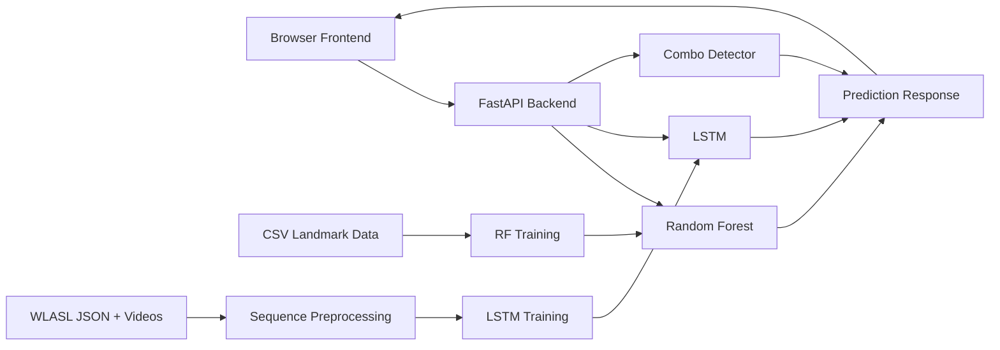
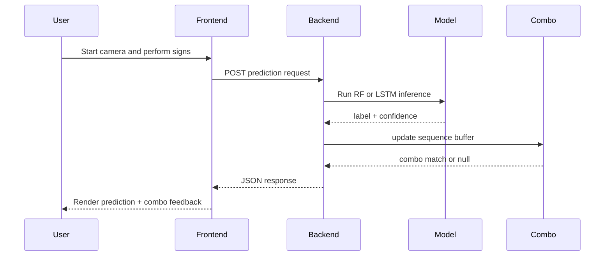
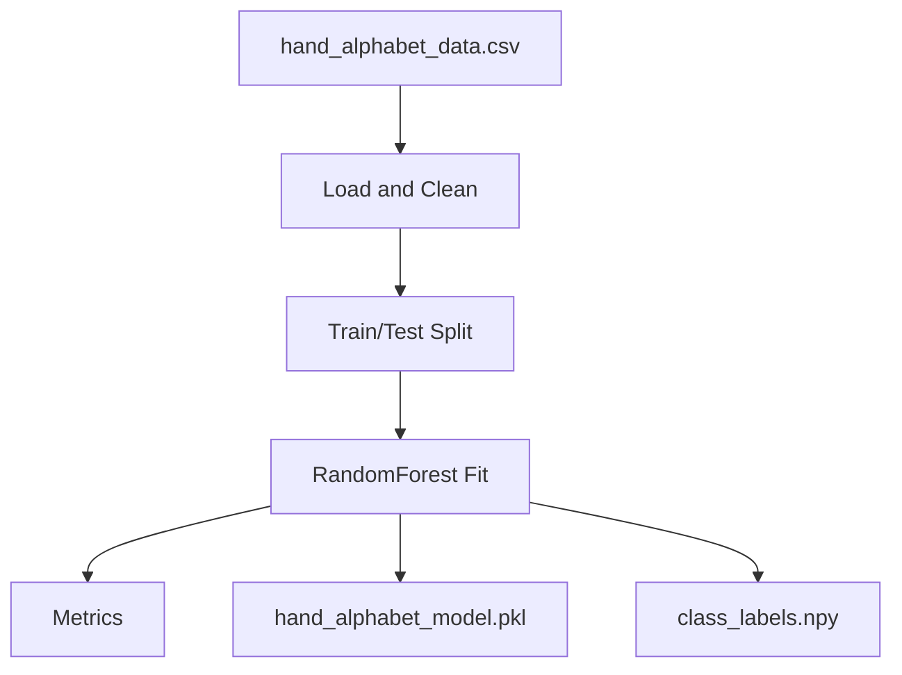
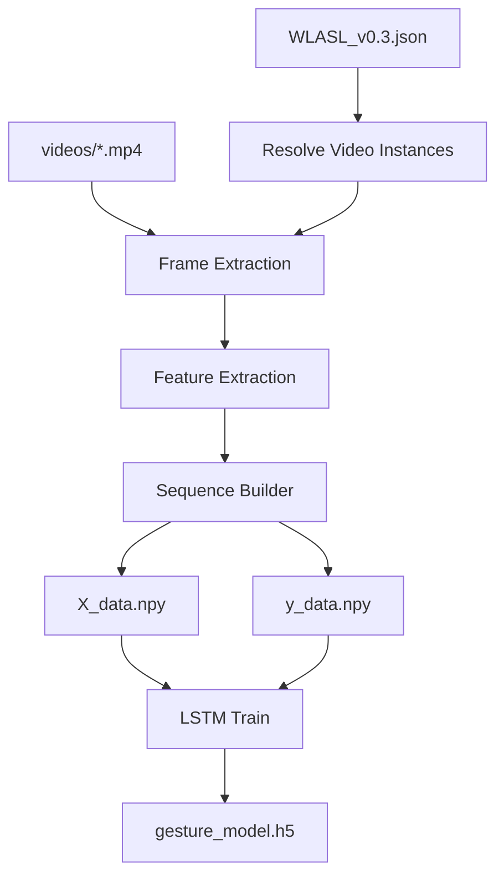
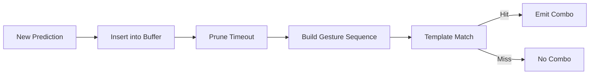
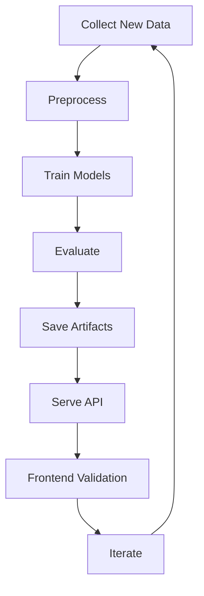

# Hand Sign Detection Dynamic

An end-to-end hand sign recognition platform with:

- Real-time gesture detection through a browser frontend.
- FastAPI inference backend.
- Static gesture modeling (Random Forest).
- Dynamic sequence modeling (LSTM).
- Gesture combo detection on top of base predictions.

This repository is structured for both learning and production-style iteration: data processing, model training, model serving, and user-facing inference are all represented.

## What This Project Solves

- Detects hand signs from webcam input.
- Supports both single-frame and sequence-based recognition.
- Allows retraining with CSV and video-derived data.
- Exposes a web UI for detection and training operations.
- Tracks multi-gesture combos from consecutive predictions.

## Documentation Map

- Core technical deep dive: `architecture_and_workflows.md`
- Training-focused guide: `training_guide.md`
- API + serving logic: `src/api_server.py`
- Frontend interfaces: `frontend/detection_dashboard.html`, `frontend/training_dashboard.html`

## Repository Structure

### Application Layer

- `src/api_server.py`: FastAPI app, model loading, inference endpoints, combo logic, and UI routing.
- `frontend/detection_dashboard.html`: Main prediction UI for real-time gesture detection.
- `frontend/training_dashboard.html`: Model training UI for CSV/WLASL/custom workflows.

### Training Layer

- `src/random_forest_trainer.py`: Random Forest training for static gestures.
- `src/wlasl_data_preprocessor.py`: WLASL preprocessing and sequence data extraction.
- `src/lstm_trainer.py`: LSTM training from processed sequence arrays.
- `src/training_pipeline.py`: Unified CLI for multi-model training workflows.
- `model_training_orchestrator.py`: Expanded root-level training pipeline and orchestration script.

### Data and Artifacts

- `data/hand_alphabet_data.csv`: static landmark dataset.
- `data/WLASL_v0.3.json`: WLASL metadata.
- `data/videos/`: video corpus for dynamic sequence extraction.
- `data/X_data.npy`, `data/y_data.npy`: processed sequence arrays for LSTM.
- `models/*.pkl`, `models/*.npy`, `models/*.h5`: trained model artifacts and labels.

## High-Level Architecture



## Runtime Workflow



## Data Pipelines

### 1. Static Gesture Pipeline

1. Load landmark CSV.
2. Clean rows and split features/labels.
3. Train Random Forest.
4. Evaluate and save model artifacts.



### 2. Dynamic Gesture Pipeline

1. Parse WLASL metadata.
2. Read videos and extract frame features.
3. Build fixed-size sequences.
4. Save `X_data.npy` and `y_data.npy`.
5. Train LSTM and persist `gesture_model.h5`.



### 3. Combo Detection Pipeline

1. Store rolling prediction buffer with timestamps.
2. Remove expired entries beyond timeout.
3. Match recent sequences with predefined combo templates.
4. Return combo metadata when matched.



## Setup

### 1. Environment

Create and activate a Python environment.

Windows:

```bash
.venv\Scripts\activate
```

macOS/Linux:

```bash
source .venv/bin/activate
```

### 2. Dependencies

```bash
pip install -r requirements.txt
```

Optional but useful:

- `mediapipe` for landmark-based extraction.
- `uvicorn` for ASGI serving.

## Run the Application

### FastAPI + Frontend (recommended)

```bash
python -m uvicorn src.api_server:app --host 0.0.0.0 --port 8000 --reload
```

Open:

- `http://localhost:8000`

### Streamlit (legacy/alternate)

```bash
python -m streamlit run src/streamlit_app.py
```

## Training Workflows

### Unified training (recommended)

```bash
python src/training_pipeline.py --model all
```

Other modes:

```bash
python src/training_pipeline.py --model random_forest
python src/training_pipeline.py --model lstm --data wlasl
```

### Root pipeline runner

```bash
python model_training_orchestrator.py
```

This script:

- Detects available datasets automatically.
- Trains available model pipelines.
- Saves timestamped and latest artifacts.

## API Workflow Details

Core behavior in `src/api_server.py`:

- Loads model artifacts from `models/`.
- Serves frontend HTML.
- Provides inference endpoints for single-frame and sequence input.
- Tracks combo sequences and returns combo metadata.
- Exposes helper endpoints for training and clearing combo state.

## Expected Artifacts After Training

- `models/hand_alphabet_model.pkl`
- `models/class_labels.npy`
- `models/gesture_model.h5`
- `data/X_data.npy`
- `data/y_data.npy`

## Troubleshooting

### Python command not found

Use the venv Python path directly:

```bash
.venv\Scripts\python.exe src\api_server.py
```

### MediaPipe compatibility issues on Windows

The codebase includes fallback extraction paths for compatibility scenarios.

### TensorFlow GPU warning on native Windows

This is expected for many TensorFlow versions. CPU inference/training still works.

## Development Workflow



## Roadmap

- Extend combo grammar and fuzzy matching.
- Add test coverage and CI automation.
- Add model registry/versioning metadata.
- Improve mobile and edge deployment support.

## Contribution

Contributions are welcome for:

- New dataset integrations.
- Better feature extraction methods.
- Improved frontend UX and accessibility.
- Robust evaluation and benchmark tooling.
