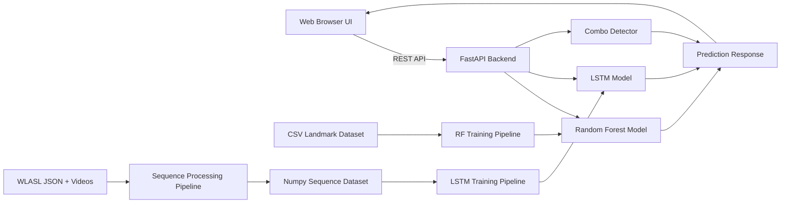
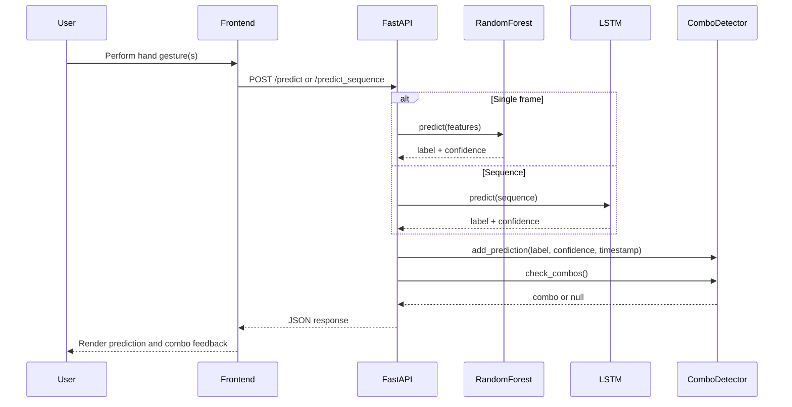
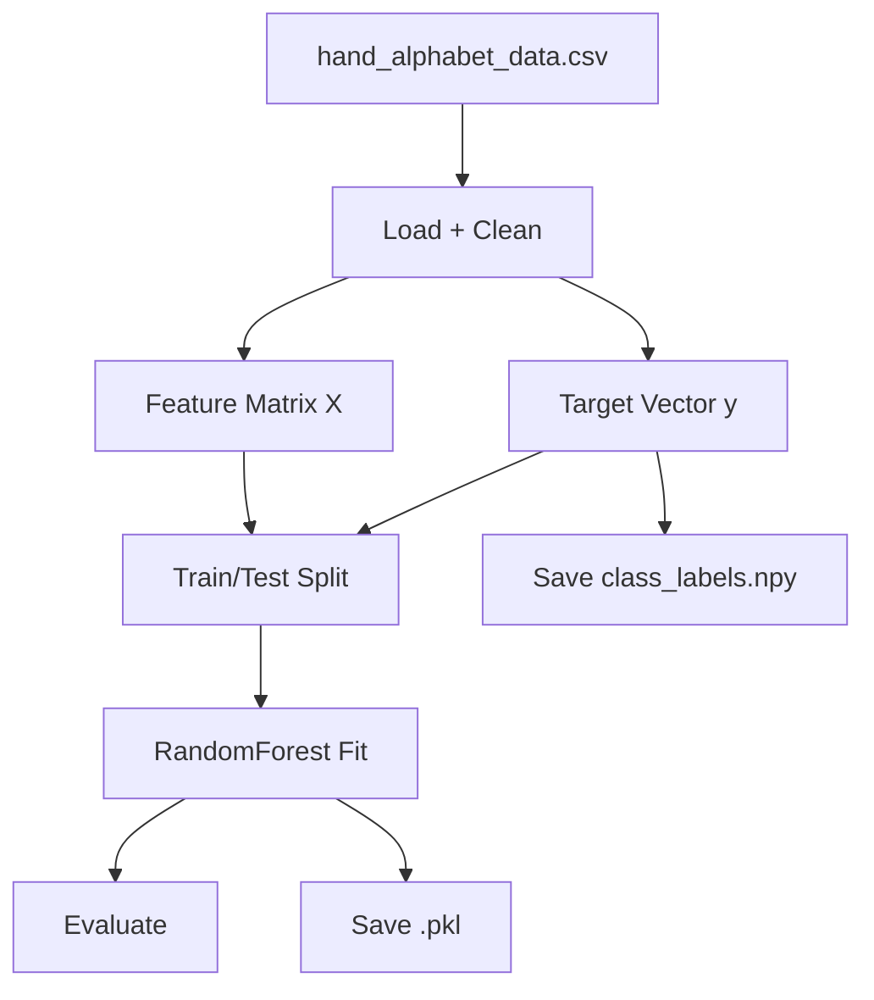
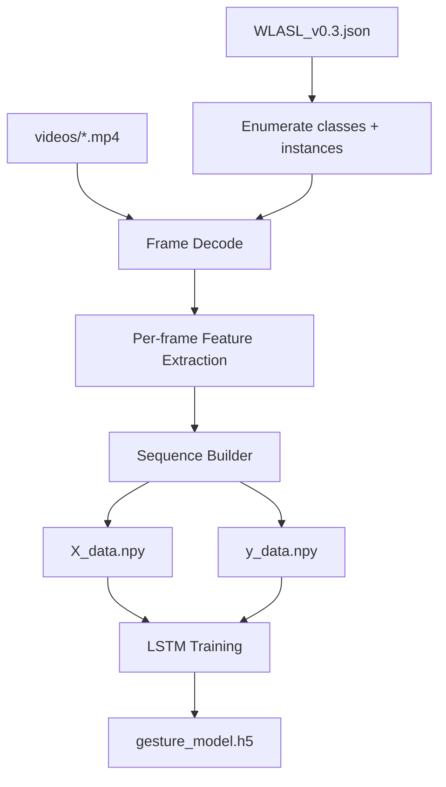
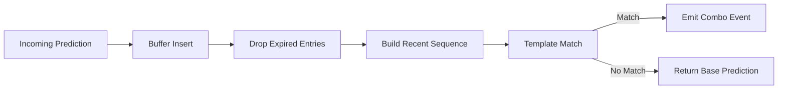
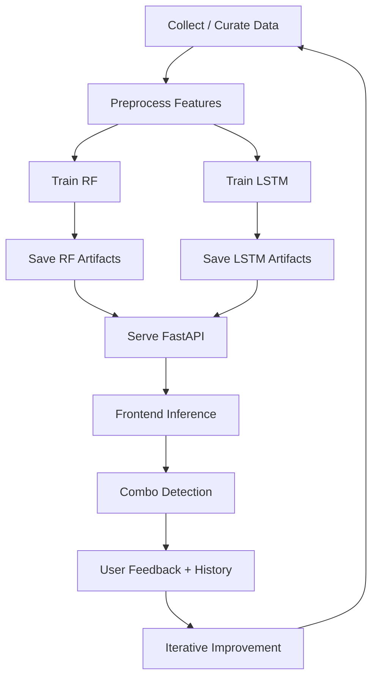

# About This Project

## 1. Purpose

This project is a complete hand sign recognition platform that combines:

- Static alphabet classification from hand landmarks using Random Forest.
- Dynamic sign sequence classification from temporal feature sequences using LSTM.
- Real-time browser-based inference through a FastAPI backend and webcam frontend.
- Model lifecycle tasks including preprocessing, training, retraining, and deployment-ready artifact saving.

The system is designed to support both experimentation and practical usage:

- Researchers can train and compare models quickly.
- Students can understand the full ML lifecycle from raw data to user-facing inference.
- Developers can extend the project with new datasets, models, and workflows.

## 2. System-Level Architecture

## 3. Runtime Workflow

At runtime, the user opens the web frontend, grants camera access, and performs signs.

- The browser captures frames from webcam stream.
- Frames are transformed into feature vectors in frontend or backend processing steps.
- The backend runs model inference.
- The backend adds prediction events into combo history logic.
- The backend returns prediction, confidence, and optional combo detection payload.
- The frontend renders confidence bars, model source, and combo history.

## 4. Data Pipelines

### 4.1 Static Pipeline (Alphabet CSV -> Random Forest)

Input format:

- Rows: samples.
- Columns: flattened landmarks/features.
- Last column: class label.

Stages:

1. Load CSV and sanitize null or invalid rows.
2. Split features and labels.
3. Train/validation split.
4. Random Forest training.
5. Metric generation (accuracy, classification report).
6. Save model and class labels.

### 4.2 Dynamic Pipeline (WLASL Videos -> LSTM)

Input format:

- WLASL metadata JSON for gloss and instance mapping.
- Video files in dataset folders.

Stages:

1. Parse JSON metadata and locate videos.
2. Decode frames per video.
3. Extract per-frame features.
4. Build fixed-length sequences with padding/truncation.
5. Create sequence tensor `X` and label array `y`.
6. Train LSTM on temporal sequences.
7. Save trained `.h5` model and labels.

## 5. Combo Detection Pipeline

Combo detection adds a temporal language layer on top of base gesture predictions.

Core behavior:

- Every prediction is inserted into a bounded time-window buffer.
- Low-confidence predictions can be filtered.
- Gesture sequences are matched against predefined combo templates.
- On match, a combo payload is emitted with aggregate confidence.

## 6. Model Artifacts and Their Roles

- `models/hand_alphabet_model.pkl`: primary static classifier used for single-frame alphabet detection.
- `models/class_labels.npy`: class ordering for decoding RF outputs.
- `models/gesture_model.h5`: temporal model for sequence-level sign recognition.
- `data/X_data.npy`, `data/y_data.npy`: processed sequence tensors for LSTM training.

These artifacts are intentionally separated from source code so retraining and deployment are independent from app logic updates.

## 7. API Behavior Summary

Main endpoints support:

- Health or page rendering routes.
- Single prediction from current frame features.
- Sequence prediction for fixed timesteps.
- Combo management and reset behavior.
- Training triggers for selected pipelines.

The API response contract consistently includes prediction metadata and optionally combo metadata, enabling frontend rendering logic without model-specific UI branches.

## 8. Frontend Behavioral Model

Frontend responsibilities:

- Capture webcam stream.
- Trigger manual or auto prediction requests.
- Display confidence and selected model context.
- Render combo detection banners and combo history.
- Provide training entry points for user-guided data/model updates.

This keeps user interaction in browser code while preserving model and business logic in the backend.

## 9. Reliability and Performance Considerations

### 9.1 Latency

Latency has three major contributors:

- Feature extraction cost.
- Model inference cost.
- API roundtrip and serialization overhead.

In practice, Random Forest provides low-latency predictions, while LSTM incurs higher inference cost due to sequence processing.

### 9.2 Model Drift

If user environment changes (camera angle, lighting, hand scale), prediction quality can decline. This is handled through retraining workflows and updated dataset capture.

### 9.3 Fallback Strategies

Where optional dependencies are missing, fallback extraction approaches can still enable partial workflows, improving portability.

## 10. End-to-End Operational Workflow

## 11. Why This Design Works

This project intentionally decomposes concerns:

- Data engineering is separated from inference serving.
- Static and dynamic tasks use model types aligned to their temporal complexity.
- Combo logic is layered on top of model outputs, not entangled with model internals.
- Frontend remains lightweight and model-agnostic through a stable API contract.

The result is a maintainable, extensible platform where each layer can evolve independently while still supporting a coherent end-to-end user experience.
